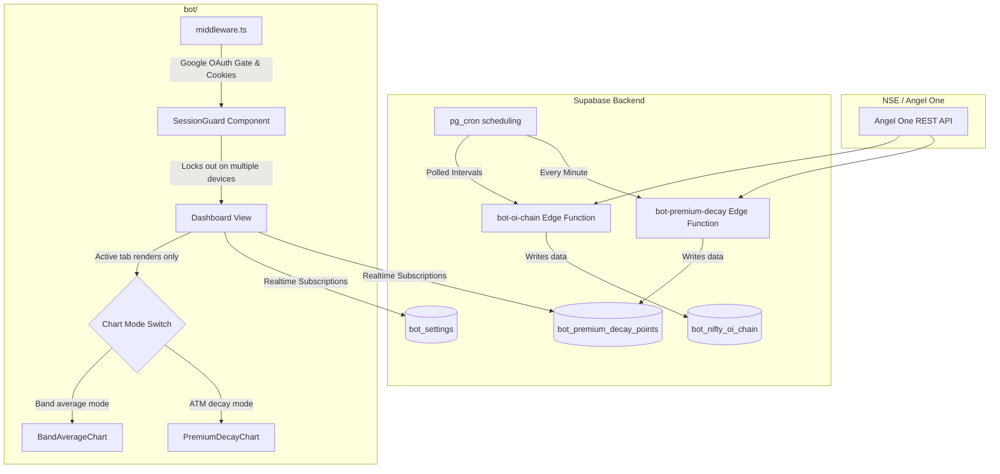

# NIFTY Options Dashboard — Technical & Architectural Documentation

This document serves as the authoritative guide for the new **NIFTY Options Dashboard** located in the `bot/` directory. It explains the design choices, UI behaviors, database schemas, real-time synchronization, and security gates, enabling other agents or developers to quickly understand the codebase without scanning every individual file.

---

## 1. Overview & Architecture

The Options Dashboard monitors live and historical NSE option chain behaviors—specifically tracing option premium decay and Open Interest (OI) metrics. 

Unlike the legacy "Market Sniper" (`dashboard/`), which is deprecated and runs on standard Supabase client polling, the new dashboard (`bot/`) leverages a next-generation architecture featuring **Next.js 16 (App Router)**, **React 19**, **TailwindCSS**, and real-time streaming subscriptions to a PostgreSQL database powered by **Supabase edge functions and pg_cron**.



---

## 2. Visual & UI System

### Grid-Layout & Toggle Controls
* **Live vs. Historical Dashboard Modes:** Toggle between live session tracking and historical date selections.
* **Chart-Selector Toggle:** A dual-button selector swaps between:
  1. `ATM premium decay` (At-The-Money premium decay chart)
  2. `Band average` (Average strike-band decay chart)
* **Single Render Optimization:** Only the selected chart is mounted to prevent inactive background queries or redundant Supabase Realtime channel listeners.

### SVG Canvas & Horizontal Scrolling
* **Full-Session Timelines:** NSE options sessions run from **9:15 AM to 3:30 PM IST**, spanning exactly **376 one-minute slots**. 
* **Dynamic Canvas Scaling:** The layout width scales dynamically according to total session minutes:
  * Width is calculated by: `getPremiumDecaySvgWidth(totalMinutes)`.
  * If the session exceeds 120 minutes, the canvas expands to allow horizontal scrolling, preventing tight compression of data points.
* **Scroll Position Focus:** When mounting, the scroll container automatically scrolls all the way to the right so that the user is immediately shown the latest real-time prices.
* **Plot Area Clipping:** SVG rendering utilizes clip paths defined via `getPremiumDecayPlotClipRect()`. CE/PE filled areas and line strokes are clipped neatly to the plot bounding box, leaving text labels, ticks, and interactive tooltips cleanly visible outside the bounds.

---

## 3. Data Flow & Database Schema

### Database Tables (Pre-fixed with `bot_*`)

| Table Name | Description | Key Fields |
|:---|:---|:---|
| `bot_settings` | Holds general configurations, current NIFTY LTP, previous day's open/high/low/close, and bot execution heartbeats. | `trading_enabled`, `last_heartbeat_at`, `nifty_current_ltp`, `nifty_previous_close` |
| `bot_premium_decay_points` | Stores raw CE and PE premium decay points recorded minute-by-minute. | `session_date`, `sampled_at`, `ce_decay`, `pe_decay`, `strike` |
| `bot_premium_decay_sessions` | Tracks dates on which premium decay was successfully gathered. | `session_date` |
| `bot_nifty_oi_chain` | Open Interest chain data updated periodically during market hours. | `session_date`, `sampled_at`, `strike`, `ce_oi`, `pe_oi` |
| `allowed_emails` | Whitelist for Google OAuth logins and device nonces. | `email` (PK), `session_nonce`, `session_started_at` |

### Timeline Continuity (Carry-Forward Logic)
If the market-data scraper fails to retrieve a snapshot for a specific minute:
1. The dashboard frontend identifies the gap in the sequence.
2. The last known CE and PE values are carried forward horizontally.
3. This ensures that visual paths remain straight and continuous rather than dropping to zero or inventing inaccurate diagonal stair-steps.

---

## 4. Authentication & Single Active Session Guard

```
User visits /
  │
  ├──► Middleware (middleware.ts)
  │      ├── Session Token Missing ──► Redirect to /login
  │      └── Valid Auth Session ─────► Load Page Layout
  │
  └──► SessionGuard Wrapper (session-guard.tsx)
         ├── Subscribes to Realtime Updates on 'allowed_emails' for userEmail
         ├── Nonce matches current local UUID?
         │     ├── YES ──► Render Options Dashboard Content
         │     └── NO ───► Render 'Session taken over' Lockout Screen
         └── DB Update received with a different nonce ──► Lockout immediately
```

1. **Security Gate:** Routes are shielded by a Next.js middleware using `@supabase/ssr` to read server-side cookies. Direct access redirect users to `/login`.
2. **Whitelist validation:** Upon completing Google OAuth, `auth/callback/route.ts` verifies the user's email against the `allowed_emails` table using the Supabase Service Role client. If the email is missing, the user is signed out and redirected back to `/login?error=not_allowed`.
3. **Session Nonce (Anti-Concurrent Login):**
   * When a user logs in or claims a dashboard view, a random UUID (`session_nonce`) is generated on the client and saved to `allowed_emails.session_nonce` via a server-side route `/api/session/claim`.
   * The `<SessionGuard>` component listens for Realtime `UPDATE` events on the user's row in `allowed_emails`.
   * If a second device or tab claims the session, the database nonce changes, and the first device is instantly locked out with a warning overlay.
   * As an additional safety check, a **10-second polling fallback** runs in the background to ensure lockouts trigger even if WebSockets disconnect.
   * **12-Hour Session Expiry:** Nonces are only valid for 12 hours from `session_started_at`. Once elapsed, the session is cleared, and users are redirected to `/login?error=session_expired`.

---

## 5. File Map

* [bot/src/middleware.ts](file:///Users/sohambhutkar/projects/Automation/indian-market-scanner/bot/src/middleware.ts) - Edge auth router; protects root pages, routes unauthenticated clients to `/login`.
* [bot/src/lib/supabase-browser.ts](file:///Users/sohambhutkar/projects/Automation/indian-market-scanner/bot/src/lib/supabase-browser.ts) - Browser-side client initialization using `@supabase/ssr`.
* [bot/src/lib/supabase-server.ts](file:///Users/sohambhutkar/projects/Automation/indian-market-scanner/bot/src/lib/supabase-server.ts) - Server-side client initialization for App Router handlers.
* [bot/src/components/session-guard.tsx](file:///Users/sohambhutkar/projects/Automation/indian-market-scanner/bot/src/components/session-guard.tsx) - Real-time active-session nonce sync and 12-hour session timeout checker.
* [bot/src/components/dashboard.tsx](file:///Users/sohambhutkar/projects/Automation/indian-market-scanner/bot/src/components/dashboard.tsx) - Main entry layout combining charts, marquee, heartbeats, and OI updates.
* [bot/src/components/premium-decay-chart.tsx](file:///Users/sohambhutkar/projects/Automation/indian-market-scanner/bot/src/components/premium-decay-chart.tsx) - Renders the 376-minute ATM decay chart with SVG clipping and mouse tooltips.
* [bot/src/components/band-average-chart.tsx](file:///Users/sohambhutkar/projects/Automation/indian-market-scanner/bot/src/components/band-average-chart.tsx) - Renders the strike-band average decay chart.
* [bot/src/lib/options-chart-ui.ts](file:///Users/sohambhutkar/projects/Automation/indian-market-scanner/bot/src/lib/options-chart-ui.ts) - Holds session limits, layout metrics, clip path parameters, and scroll-width functions.
* [bot/src/lib/oi-analysis.ts](file:///Users/sohambhutkar/projects/Automation/indian-market-scanner/bot/src/lib/oi-analysis.ts) - Helper functions for PCR (Put-Call Ratio) mathematical classification and maximum OI calculations.
* [bot/src/lib/premium-decay.ts](file:///Users/sohambhutkar/projects/Automation/indian-market-scanner/bot/src/lib/premium-decay.ts) - Time calculations and carry-forward sequence logic.
* [bot/src/lib/market-hours.ts](file:///Users/sohambhutkar/projects/Automation/indian-market-scanner/bot/src/lib/market-hours.ts) - Verifies if NSE market is currently active in Indian Standard Time (IST).
